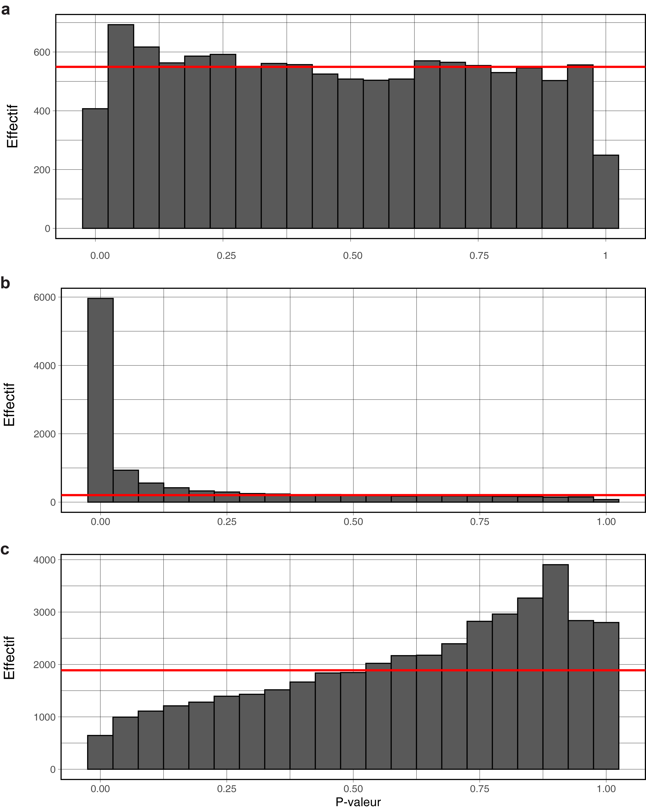


Bulk RNA-Seq pipeline v4.0
--------------------------

# Installation and launch:
1. Download the script (for example: `git clone https://gitlab.univ-nantes.fr/E114424Z/BulkRNAseq.git`)
2. Put data files (expression table and sample annotation table) in the same format as examples (.tsv with header and row names).
	
	**[optional]**: if you work behind a proxy you may have to change your *~/.Renviron* file. Example for University of Nantes :
	~~~
	http_proxy=http://cache.ha.univ-nantes.fr:3128/
	https_proxy=http://cache.ha.univ-nantes.fr:3128/
	~~~

	**[optional]**: You can provide a "*comparison to do*" file and a "*color scales*" file. See the section *Inputs and outputs of the script* for more details.

3. Run install.R **OR** use conda with:
	~~~
	conda env create -f BulkRNAseq.yml
	~~~
	One of the required R library (*qualpalr*) is not included in the conda environment, you must install it manually. Once the the environment is installed, activate it:
	~~~
	conda activate BulkRNAseq
	~~~
	Open a R session, and install qualpalr with BiocManager:
	~~~
	BiocManager::install("qualpalr",update = FALSE)
	~~~

4. Change all necessary parameters in the *Configuration of parameters* section in the script *BulkRNAseq.R*.
5. Run the script *BulkRNAseq.R*.

If you want to resume the script after an interruption, run line \#1 to the last line before the section *Configuration of parameters*, and then load the appropriate environment in the *rsave* folder (in RStudio, go to file/open file).

# Tips for analyzing bulk RNA-Seq
## A word on experimental design
The experimental design is related to what variables affect gene expression but are known before the start of the experiment. For example, with the variables **genotype [KO, WT]**,  **sex [M, F]** , and **presenceOfMarker [true, false]**, the experimental design is:
$geneExpression \sim genotype + sex$
In this case the condition columns must be *genotype* and *sex*.

Differentially expressed genes are taking account of experimental design: If you want differentially expressed genes between *WT* and *KO*, you will have differentially expressed genes, all things being equal (sex is taken into account).

We assume here that *presenceOfMarker* is the measurement of a protein presence. It is not a part of experimental design as its value for each sample is not known before the experiment is carried out.
*presenceOfMarker* can be used in the script by being put in the `otherInterestingColumn` argument.

For more complex experimental designs, the script has to be slightly modified. [See this website for more details](https://rstudio-pubs-static.s3.amazonaws.com/329027_593046fb6d7a427da6b2c538caf601e1.html).

DESeq2 is theoretically compatible with quantitative variables, however a good way to deal with it is to convert it into factors, with by example the R function *cut*.

## A word on batch correction
Batch effects are technical bias between two or more group of samples. The most common case is when the sequencing was done on two different plates. It is important to think carefully about the experimental design to avoid case where batch effect correction is not precise, or even impossible.

- Tip 1: try to split your group of samples between batches. If one group of sample is only in one batch the batch effect will be harder to retrieve.
- Tip 2: try to put technical replicates between batches to control the quality of batch correction. If you have enough technical replicates you can even retrieve batch effect only from technical replicates, [example here](https://gitlab.univ-nantes.fr/E137833T/Castel_et_al_2020/-/blob/master/Code/1_bulk_rna_seq_preprocessing.R)

For enabling batch correction, you just have to set the argument *batchColumn* to the column name that contains batches attribution in sample annotations. If you want to disable it, set it to `NULL`.

## A word on file formats
Most of text results are in TSV (tabulated separated values). The point is to not worry about the separator between French and English version of CSV. It is also enabling quick paste of data into a spreadsheet. You can open these files with Excel in windows (right click, open with, choose another program, retrieve Excel.exe, be sure to have checked the box to memorize the choice).

Most of figures are in PDF. Hence figure are easily openable on every platform and vectorized (no problem with figure resolution and editable with Adobe Illustrator or Inkscape).

## A word on distribution of p-values
For each large set of p-values that is computed, an histogram of p-values is plotted to show their distribution. 

- ***Case a:***
P-values are following an uniform distribution: samples are presumably from the same population. **Every significant result could be a false positive**. 
- ***Case b:***
A lot of p-values are more closed to 0. Samples are not coming from the same sample. In this case the samples are not coming from the same population: differentially expressed genes are real !
- ***Case c:***
Every other shape of the distribution should raise extreme caution: the model can not handle the data. It could be the case for different reasons: poor quality of data, lack of statistical power...

## A word on gene set activation score and GSDA
For different output, an "activation score" is mentioned. This score summarize the expression of a set of gene (a gene cluster, a pathway) in one sample. The methodology in this script is to make a Principal Component Analysis (PCA) with all samples but only with the genes of the gene set as features of the PCA. Then the first component is kept as the activation score of the gene set. Hence, the activation score is a linear combination of expression from the genes of the gene set. Some of the genes have a positive contribution (more there a expressed, more the activation score is positive), some could have a negative contribution (more the gene expressed, more the activation score is negative). Some gene are neutral and do not participate in the computing of activations score (contribution=0). The activation score is particularly suitable for gene sets that are pathway that contains negative regulation (antagonist ways within the pathway). When the activation score changes from negative to positive or vice versa, the state of the pathway has switch from one biological state to another.

The idea behind Gene Set Differential Activation (GSDA) is to test for each gene set if the activation score is significantly different between the groups of samples. This feature is experimental is currently unpublished.

## A word on the web application

To make the web app working you have two solution:
- deploy the app on a http server
- custom Firefox to open it without deploying a server, to do this: 
You have to go to the URL bar of Firefox and type:
`about:config`. Then you have to take the risk, then turn `security.fileuri.strict_origin_policy` to false by clicking on it.
Voilà, you can open index.html with Firefox.

A tutorial to use an interface very close to the web app is available [here](https://www.youtube.com/watch?v=C7lachmT7LA).

# Inputs and outputs of the script

 📂**data** Contains the inputs given by the user.

 ┣ 📜**colorScales.json** 
 Example of file to give for custom color scales in figures. If this file is not given, or if some variable are not mapped to colors, remaining color scales that are necessary for the script will be automatically computed.

 ┣ 📜**ComparisonToDo.tsv** 
Example file to give if you want to make specific comparisons between your groups of samples, if this file is not given, all possible comparisons will be done. 

 ┣ 📜**msigdb.v7.2.symbols.gmt** Example of custom gene set database for enrichment.

 ┣ 📜**rawCounts.tsv** Raw counts table of gene expression.

 ┗ 📜**sampleAnnot.tsv** 
 Sample annotations (data for each sample that are not gene expression).

 📂**figs** Output figures.

 ┣ 📜**QualityControlOfSamples.pdf**
 Number of expressed genes (at least one count) for each sample in function of number of counts. Samples below the red lines are excluded from the analysis. You should adjust the parameter of the script by examining this figure (for example, discard isolated samples).

 ┣ 📜**QualityControlOfGenes.pdf**
 Close to the overdispersion plot but before the normalization of data. You can adjust the threshold to eliminate gene that are close tobe not expressed at all, and hence, have aberrant dispersion.

 ┣ 📜**BatchEffectCorrectionControl.pdf** 
 Control of the effect of batch correction (if necessary). This figure contains a PCA before and after batch correction, with the first variable of the experimental design and the variable of batch projected on them.

 ┣ 📜**HeatmapCorPearson.pdf** 
 Square heatmap of the sample to sample Pearson correlation. If there is a step of batch correction, the second page is the heatmap before the batch correction.
 ┣ 📜**markersOfUnsupervisedClusters.pdf** 
 Heatmap of best markers of unsupervised sample clusters. The number of markers represented in each cluster is controlled by the parameter *topGeneShown*.

 ┣ 📜**moduleActivationScore.pdf** 
 Heatmap from activation score of each unsupervised gene cluster (gene module) in each sample.

 ┣ 📜**overDispersionPlot.pdf** 
 Dispersion in function of average expression for each gene. A regression is fitted and represent the theoretical dispersion for a given mean. A gene above this curve is *overdispersed* and is likely to be differentially expressed as his dispersion can not be explained only by technical and biological variations between samples from the same populations. Genes that are under the curves are *underdispersed*, and could be for instance be a good candidate as a housekeeping gene for a PCR.

 ┣ 📜**PrincipalComponentAnalysis.pdf**
 PCA main figure. Percentage of variance of data explained for each principal component, then for the first combination of two PCs: projection of samples colored by variable from sample annotations, correlation circle (contribution of genes to the PCs, or gene eigenvalues).

 ┣ 📜**PrincipalComponentRegression.pdf**
The PCR regression of PCs from the PCA on given features (here variable from sample annotations). The given R squared is representing the link between the PC and the variable.

 ┣ 📜**superHeatmap.pdf**
 Heatmap of the whole transcriptome, spitted by gene modules and unsupervised sample clusters. Height of each row slice is log proportional to the number of genes in the gene module.

 ┣ 📜**UMAP.pdf**
 Non linear projection of samples in a 2D space by the UMAP method.

 ┗ 📜**upsetPlot.pdf**
 Summary of differential expression analyses. Each column can be seen as a Venn diagram, each row represent a comparison. The enrichment is the observed intersection size divided by the intersection size expected given the gene set size and the universe (the total number of gene).

 📂**resPerComparison** Outputs that are specific to each comparison.
 ┣ 📂 **\[comparison name]**

 ┃ ┣ 📜**DESeqResults.tsv** Results from DESeq2 with the following columns:
- **baseMean**: Average expression of the gene.
- **log2FoldChange**: Ratio of expression between sample groups (followed by a log2): $log2(downLevel/upLevel)$. *downLevel* refers to samples that belongs to the group where if a gene is more expressed, the gene is considered as downregulated. *upLevel* the group where a gene is more expressed is considered as upregulated. Example: between a Wild-type (*downLevel*) and a KO (*upLevel*) group of samples, when $log2FoldChange=0$ the gene have the same expression in both group. When $log2FoldChange=1$ the gene is two times more expressed in KO than in WT group, and when $log2FoldChange=-1$ the gene is two time more expressed in WT.
	This statistic is not directly calculated from the data but from the slope of a regression made by DESeq2. 0 means no difference, -1: samples from the "down level" are expressing the 
- **lfcSE**: Dispersion of *log2FoldChange* (log2FoldChange standard error).
- **stat**: Statistic of test, this value is compared to the null distribution to retrieve the p-value.
- **pvalue**: Probability to observe this $|log2FoldChange|$ or greater if the gene would be uniformly expressed between the two groups (samples are from the same population). Do not use this value directly into your paper,but the *padj* instead.  
- **padj**: Adjusted p-value. If the samples are from the same population ($H0$ is true for every gene), with a significativity threshold at 0.05, then 5% of the give would be significant and hence correspond to false positives. The adjusted p-value take account of the number of false positive that are growing in the same time than number of test and minimize the risk to have at least one false positive.
- **isDE**: DOWNREG: gene is significant and more expressed in *downLevel* group, UPREG: gene is significant and more expressed in *upLevel* group, NONE: gene is not differentially expressed.
 ┃ ┣ 📜**heatmapDEgenes.pdf**
 Heatmap of differentially expressed genes. Samples from the comparison are separated from the rest.

 ┃ ┣ 📜**pvalHistogram.pdf** Distribution of p-values from DESEq2.

 ┃ ┗ 📜**volcanoPlot.pdf**
 Adjusted p-values from DESeq2 in function of Log2FC with additional information on the comparison. Significance threshold are represented.

 ┃ ┣ 📜**MA-plot.pdf** Log2FC in function of average expression. Legend is the same than in the volcano plot. 

 ┃ ┣ 📜**focusOnTop10genes.pdf**
 Expression of the top ten genes, with a special y scale $log10(x+1)$

 ┃ ┣ 📜**GSDA_enrichment.tsv** Gene Set Differential Activation results.

 ┃ ┣ 📜**GSDA_heatmap.pdf**
 Heatmap of activation score for top significant gene sets. Contribution of most negative/positive genes are represented at the right. 

 ┃ ┣ 📜**GSDA_pvalHistogram.pdf** Distribution of p-values from GSDA.

 ┃ ┣ 📜**GSDA_Volcano.pdf** Volcano plot of GSDA, each dot is a gene set.

 ┃ ┣ 📜**GSEA_enrichment.tsv** Results from the GSEA enrichment, with these specific columns:
- **pathway**: Name of the gene set. 
- **ES, NES**: Enrichment and new enrichment score. If NES>0 genes from the gene set are high ranked (genes are globally upregulated in the gene set), if NES<0, genes are low ranked (genes are globally downregulated).
- **size**: Number of genes in the gene set.
- **database**: database name where the gene set come from
- **Gene**: genes of the gene set

 ┃ ┣ 📜**GSEA_heatmapPerPathway.pdf**
 Expression heatmap fot top significant gene sets.

 ┃ ┣ 📜**GSEA_pvalHistogram.pdf**
 Distribution of p-values from GSEA.

 ┃ ┣ 📜**GSEA_volcano.pdf**
 Volcano plot of GSEA, each dot is a gene set. Log2FC is not applicable for GSEA and is replaced with NES.

 ┃ ┣ 📂**pathview** For each top significant KEGG pathway, schematic of the pathway.

 ┃ ┃ ┣ 📜 **\[pathway name].pathview.png** Projection of Log2FC on the KEGG schematic.

 ┃ ┃ ┣ 📜 **\[pathway name].png** KEGG schematic without projection of Log2FC.

 ┃ ┗ ┗ 📜 **\[pathway name].xml** Information on mapping between genes and KEGG schematic.

 📂**results** Output data in text formats.

 ┣ 📜**QualityControlOfGenes.tsv** Values of *QualityControlOfGenes.pdf*

 ┣ 📜**QualityControlOfSamples.tsv** Values of *QualityControlOfSamples.pdf*

 ┣ 📜**sampleAnnotations.tsv** Sample annotations in input with the adding of some statistics and attribution of unsupervised sample clusters.

 ┣ 📜**geneAnnotations.tsv**
 Statistics on each gene, with the following columns:
- **mu**: average expression
- **var**: dispersion (variance)
- **cv2**: The squared coefficient of variation $(\frac{variance}{mean^2})^2$ is another dispersion estimator. It is also the y-axis of the overdispersion plot.
- **residuals**: distance between the fitted line in overdispersion plot and the gene. Can be interpreted as an overdispersion score. 
- **residuals2**: Squared residuals.
- **fitted**: y-value of the regression curve at the same x-axis than the gene.Can be interpreted as the expected dispersion for the gene.
- **Module**: unsupervised gene cluster (gene module) attribution. M0 is the default module (genes that are not attributed to a real gene module).
- **Membership**: Membership score of the gene to its gene module. Not applicable if the gene come from M0.

 ┣ 📜**normCounts.tsv**
 Normalized counts table, each gene follows a negative binomial distribution. Useful for plotting expression and work with methods that handle negative binomial distribution.

 ┣ 📜**normCorrectedCounts.tsv**
  Normalized counts table but batch corrected.

 ┣ 📜**logCounts.tsv**
 Log normalized counts table, each gene follows approximatively a normal distribution. Useful for most of multivariate analyses. NB: To be more precise, these counts are not logged but a variance stabilization transformation (VST) has been applied. Result is closed but less biased than real log counts (usually $log2(expr+1)$ ).

 ┣ 📜**logCorrectedCounts.tsv**
Log normalized counts table but batch corrected.

 ┣ 📜**countsPerMillion.tsv** 
CPM: Raw count table adjusted by library size then multiplied by one million. If the technology of sequencing is UMI-based, then we can also talk about UPM (UMI Per Million) or TPM (Transcript Per Million). This count table is useful for representing gene expression, but should not be chosen for analysis purposes.

 ┣ 📜**contribGenesPCA.tsv** Eigengenes of PCA (values of correlation circles).

 ┣ 📜**markerAUCsPerSampleCluster.tsv**
 Aera Under ROC curve (AUROC) for each gene for each unsupervised sample cluster. A value of 0.5 means that the gene is not a marker, 1 that the gene is a perfect marker, and 0 a perfect negative marker (if it is expressed , we are sure to not be in the sample cluster).

 ┣ 📜**moduleActivationScore.tsv**
 Activation score for each sample for each gene module.

 ┣ 📜**moduleMembership.tsv**
Membership for each gene for each module. It is computed by $cor(expressionOfGene,moduleActivationScore)$.

 ┣ 📜**geneSetActivations_\[geneset_database].tsv**
 Activation scores for the given gene set databases.

 ┣ 📜**geneSetsContributions_\[geneset_database].tsv**
 Contribution of gene of each gene set activation score.

 ┗ 📂**EnrichmentPerGeneModule**
 Enrichment for each gene module (hypergeometric test from a contingency table for each gene set).

 📂**rsave** Folder that contains R objects / R session images.
 ┗ **📜Step\[#].RData** 
 Each of these files contains a save of the R environment at given steps of the script. Useful if you want to resume the execution at a certain point of the analyses.

 📂**webApp** Directory that contains the web application.

 ┣ 📂**\[most of folders]** Code and data that are necessary to run the web app.

 ┣ 📂**prepare** 
 Contains files that are necessary to build the web application, but are no longer required to run it.

 ┗ 📜**index.html** 
 Main html page. This is the file to open with your browser to begin to use the web application.

# Warnings
- Sample names can contain characters (upper and lower case), digits, dots and underscores. It must begin with a character. Samples that are not following these guidelines will be automatically renamed.
- Do not open counts table files with Excel then save: Excel converts some gene names into date.
- Do not hesitate to remove abnormal sample (see figs/QualityControlOfSamples.pdf). You can edit manually the variable *sample2keep* to remove samples without editing input files.
- For each condition you must have a minimum n of 2, otherwise you can run the script up to `save.image("rsave/Step2.RData")`. Bulk RNA-Seq analysis should be made with at least 6 biological replicates per group, more if the conditions are close in term of gene expression, or if the experimental design is complex.

# Brief summary of the workflow

## Step 1: loading data, building model and generation of counts tables
- Loading homemade function from the repository veneR, NB: you can clone the repository locally if you want to use the script without an internet connection. Loading and verifying data given by the user, setting of the seed and creation of output folders.
- Quality control of genes / samples.
- Generation of color scales and the comparison matrix from the experimental design.
- Species-specific data download  (download the *org.sp.eg.db* package if not already installed).
- Compute DESeq2 model
- Normalization and transformation of counts
- Batch correction
- Computing of CPM

## Step 2: Unsupervised and multivariate analyses
- Computing of the overdispersion plot
- Principal Component Analysis and Regression (and batch correction control if applicable).
- Correlation heatmap
- 2D UMAP from over dispersed genes, sample clustering from an density based clustering on an alternative 10D UMAP.
- gene module attribution by a hierarchical clustering of overdispersed genes from a distance of biweight midcorrelation (bicor).
- Computing modules activation scores and module memberships.
- Computing AUROCS for each gene for each sample cluster.
- Plotting the super heatmap.

## Step 3: Differential gene expression analyses
- For each comparison, computing of results and plot of DE analyses. By default these operations are multithreaded.
- Plotting heatmaps of DE genes.
- Upset plot

## Step 4: Functional enrichment
- Downloading gene set databases
- Gene Set Enrichment Analyses (GSEA).  Heatmap and use og pathview for significant pathways.
- Gene Set Differential Activation (GSDA, experimental)
- Enrichment of gene module with a simple enrichent method (from a contingency table for each gene set).

## Step 5: Building of the web app

[Link to my PhD manuscript](https://gitlab.univ-nantes.fr/E114424Z/tutodudaron/-/blob/master/th%C3%A8seV3.pdf) to go further (in French).

# Credits and thanks
Pipeline written by Dimitri Meistermann, University of Nantes, at the time PHD student in computational biology at CRTI (UMR 1064) and LS2N (UMR 6241). PHD supervised by Jérémie Bourdon (UMR 6241) and Laurent David (UMR 1064).

current mail: dimitri.meistermann@helsinki.fi.

Special thanks to Hayat Hage to have written the very first lines of this script.
